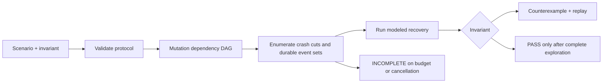

# PersistScope

Find the crash that breaks your file update protocol—before it becomes a recovery incident.

PersistScope is a dependency-free C++20 library and CLI that explores crash states of small persistence protocols. Describe writes, renames, syncs, acknowledgement, and recovery; receive either a complete result under the model, a concrete counterexample, or an explicit incomplete result.

Use it to review configuration replacement, checkpoint publication, and multi-file recovery logic. It runs entirely in memory: no mounts, elevated privileges, services, or destructive fault injection.



## Five-minute quickstart

Requires CMake 3.20+, a C++20 compiler, and Python 3.9+ for integration tests. No third-party runtime libraries are required.

```sh
git clone https://github.com/Nima0101/persistscope.git
cd persistscope
cmake -S . -B build -DCMAKE_BUILD_TYPE=Release
cmake --build build --config Release
ctest --test-dir build -C Release --output-on-failure
```

Find the missing directory sync:

```sh
./build/bin/persistscope check examples/atomic-broken.pscope
```

This command intentionally exits **1** with a counterexample: a save was acknowledged, but the old configuration survived. Then check the repaired protocol and a two-file recovery protocol:

```sh
./build/bin/persistscope check examples/atomic-fixed.pscope
./build/bin/persistscope check examples/journal-recovery.pscope
```

Both should report `PASS`. On Windows, use `.\build\bin\persistscope.exe` for the executable; the CMake commands are unchanged.

The fix is small enough to review:

```text
persistscope 1
initial config old
run
create staging
write staging new
fsync staging
rename staging config
sync_dir
ack
check
expect config old new
expect_after_ack config new
```

`fsync staging` makes the file data durable. `sync_dir` makes the rename durable. Acknowledging before that second boundary permits the reported rollback.

## What a result means

| Result | Exit | Meaning |
|---|---:|---|
| PASS | 0 | Every crash outcome at every cut satisfies the invariant under this model. |
| FAIL | 1 | A concrete modeled crash outcome violates the invariant. |
| Invalid input | 2 | The scenario, options, or replay witness is invalid. |
| INCOMPLETE | 3 | The exploration budget was exhausted; no success claim is made. |

The checker includes the initial state and the state after each operation. Unsynced changes may survive a crash. Recovery executes after each crash image; assertions inspect its resulting snapshot. An acknowledgement enables stronger assertions without persisting anything itself.

The default budget is 100,000 search nodes. Use `--max-nodes N` to change it and `--json` for versioned machine-readable output. See [the CLI contract](docs/protocol.md) for replay syntax and scenario grammar.

## The model boundary

PersistScope checks **your model of a protocol**, not your application's syscalls or a physical filesystem. The model identifier is `ordered-file-v1`.

- `write` replaces a complete content value atomically in the model. It does **not** simulate a potentially torn OS write. Use `patch` for ordered byte events and torn in-place updates.
- Data mutations on the same inode persist in order. Namespace events form a dependency DAG through names they touch. A rename is one atomic namespace event; unrelated names can persist independently.
- Data durability and namespace durability are separate. File sync forces preceding data events for that inode; directory sync forces preceding namespace events.
- Recovery runs uninterrupted. Concurrent application operations, crashes during recovery, failed syscalls, hardlinks, real directory trees, and device-specific guarantees are outside v0.1.

A passing result is useful only when these assumptions fit the protocol. See [architecture](docs/architecture.md) and [engineering deep dive](docs/engineering-deep-dive.md) for precise reasoning and limits.

## Embed it

The [public header](include/persistscope/persistscope.hpp) exposes `Scenario`, `Operation`, `Snapshot`, `Limits`, `check`, and `replay`. Supply an invariant that returns an explanation on failure or `std::nullopt` on success. Recovery is a sequence of modeled operations. Cancellation is a synchronous callback in `Limits`.

See the [C++ API and installation guide](docs/api.md) and the [reproducible benchmarks](benchmarks/README.md). Link the CMake target `PersistScope::core`. Independent calls own their state; callbacks and captured data remain the caller's responsibility.

## Platforms and security

The implementation targets GCC, Clang, and MSVC. Linux, macOS, and Windows verification is pending the initial CI runs; build portability is not a claim about those systems' filesystem semantics.

The CLI reads one scenario and writes results to standard output. Virtual filenames never become host paths. There is no network access or command execution. Reports include scenario contents, so use synthetic data. Embedded C++ callbacks execute with your process's privileges. See [SECURITY.md](SECURITY.md) and the [threat model](docs/threat-model.md).

## Development and roadmap

See [CONTRIBUTING.md](CONTRIBUTING.md) for build, sanitizer, and formatting commands. The [research decision](research/PROJECT_DECISION.md) explains the scope and alternatives.

Next work: crashes during recovery, additional explicit persistence models, smaller counterexamples, and adapters that reduce the gap between application code and modeled traces. Each changes the verification boundary and needs its own tests.

MIT licensed. Contributions to model semantics, counterexamples, and documentation are welcome.
